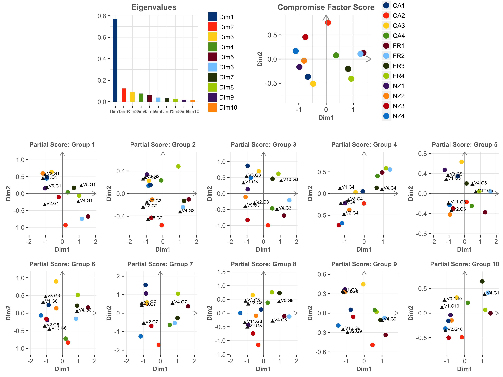
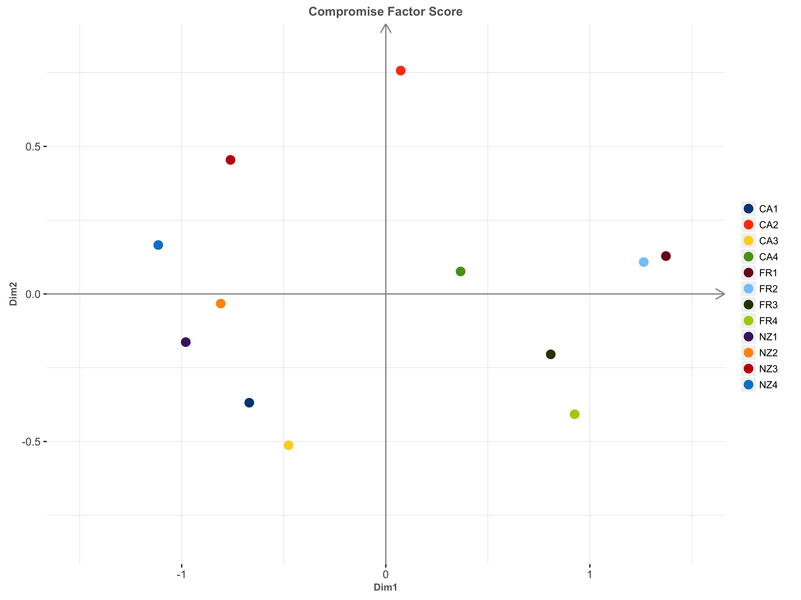

## Multiple Factor Analysis

Overview

- Multiple factor analysis (`MFA`, also called multiple factorial analysis) is an generalization of principal component analysis (`PCA`). Its goal is to analyze several data sets of variables collected on the same set of observations, or—as in its dual version—several sets of observations measured on the same set of variables.

- MFA is used when several sets of variables have been measured on the same set of observations. The number and/or nature of the variables used to describe the observations can vary from one set of variables to the other, but the observations should be the same in all the data sets.

--- .class #id1 

## Main Idea

- The general idea behind MFA is to normalize each of the individual data sets so that their first principal component has the same length. 

- There are several terms with regards to MFA: 
  * `Compromise/Consensus`
  * `Factor Scores`
  * `Partial Factor Scores`
  * `Contributions`

--- .class #id2


##  DATA Preprocesing 

- `Centering and Scaling`：first normalize each column such that its mean is equal to 0 and the sum of the square values of all its elements is equal to 1. 

- `Concatenating data tables`：The raw data consist of K data sets collected on the same observations. The $K$ data matrices $\textbf{X}_{[k]}$ are concatenated into the complete $I$ by $J$ data matrix denoted by $\textbf{X}$.

--- .class #id3

##  Maths behind the package 

`Weight Matrix` and `Mass Matrix`

- `Mass Matrix` has its diagonal elements as mass of each observation:
$$\begin{equation}
\textbf{M}=\text{diag}\{\textbf{m}\}
\end{equation}$$

- `Weight Matrix` has its diagonal elements as the inverse of the first squared singular value multiplied by a $J_{[k]}$ vector of ones:
$$\begin{equation}
\textbf{a}=[\alpha_1\textbf{1}_{[1]}^T,...,\alpha_k\textbf{1}_{[k]}^T,...,\alpha_K\textbf{1}_{[K]}^T]
\end{equation}$$


--- .class #id4

##  Maths behind

GSVD

- Do `Eigendecomposition` to get eigenvector and eigenvalue etc.
$$\begin{equation}
\textbf{S}_{[+]}=\textbf{X}\textbf{A}\textbf{X}^{\textbf{T}}.
\end{equation}$$
$$\begin{equation}
\textbf{S}_{[+]}=\textbf{U}\boldsymbol{\lambda}\textbf{U}^T=\textbf{P}\sqrt{\textbf{M}}\boldsymbol{\lambda} \sqrt{\textbf{M}}^T\textbf{P}^T=\textbf{P}\boldsymbol{\Lambda}\textbf{P}^T
\end{equation}$$
- Under the constraints: 
$$\begin{equation}
\textbf{S}_{[+]}=\textbf{P}\Lambda \textbf{P}^{\textbf{T}} \quad \text{with} \quad \textbf{P}^{\textbf{T}} \textbf{M}\textbf{P}=\textbf{I}.
\end{equation}$$

--- .class #id5

##  Maths behind

- Compute `partial factor score` $\textbf{F}_{[k]}$ and `common factor score` $\textbf{F}$
$$\begin{equation}
\textbf{F}_{[k]}=K\alpha_k\textbf{X}_{[k]}\textbf{Q}_{[k]}\qquad
\textbf{F}=\frac{1}{K}\sum_k \textbf{F}_{[k]}
\end{equation}$$
- `Contributions` of Observations, Variables and Tables
$$\begin{equation}
ctr_{i,l}=\frac{m_i × f_{i,l}^2}{\lambda_l} \quad \text{with} \quad \lambda_l=\sum_i m_i × f_{i,l}^2
\end{equation}$$
$$\begin{equation}
ctr_{j,l}=a_j × q_{j,l}^2 \quad \text{with} \quad 1=\sum_j a_j × q_{j,l}^2
\end{equation}$$
$$\begin{equation}
ctr_{k,l}=\sum_j^{J_{[k]}} ctr_{j,l}
\end{equation}$$

--- .class #id6

##  Maths behind

- `R_V  coefficient` between data tables $k$ and $k′$ is computed as
$$\begin{equation}
\frac{\text{tr}\{(X_{[k]}X_{[k]}^T) \times (X_{[k']}X_{[k']}^T)\}}{\sqrt{\text{tr}\{(X_{[k]}X_{[k]}^T)\times (X_{[k]}X_{[k]}^T)\}\times \text{tr}\{(X_{[k']}X_{[k']}^T)\times (X_{[k']}X_{[k']}^T)\}}}
\end{equation}$$
- `L_g  coefficient` between data tables $k$ and $k′$ is computed as
$$\begin{equation}
\begin{aligned}
\frac{\text{tr}\{(X_{[k]}X_{[k]}^T)× (X_{[k']}X_{[k']}^T)\}}{\gamma_{1,k}^2 × \gamma_{1,k'}^2}
\end{aligned}
\end{equation}$$

--- .class #id7

## Bootstrap

- The bootstrap is using to estimate the stability of the compromise factor scores. 
- We obtain bootstrap confidence intervals (CIs) by repeatedly sampling with replacement from the set of tables and compute new compromise factor scores. From these estimates we can also compute `bootstrap ratios` for each dimension by dividing the mean of the bootstrap estimates by their standard deviation.  

--- .class #id8

## MFA

Getting started

-To run any of the MFA functions, make the package active by using the library command:

```r
library(MFA)
```
We are using a data example included in the package MFA to illustrate the use of the MFA package step by step. This data example concerns 12 wines from three
wine regions and 10 expert assessors
were asked to evaluate these wines on 9-point rating
scales, using four standard variables plus extra variables if any aseessor feels necessary. We call the variables used by one assessor as one group or one table. 

--- .class #id9

##  Prepare the input data

The data on which we apply MFA functions should be either data frame or matrix object in R. The users could of course read data from a local file and here are of course many ways to enter data into R, just make sure prepare the data to be analyzed as data frame or matrix. The data example 'wine' has been loaded in the global environment in R when loading the MFA package. Here we show part of the 'wine' data:

```r
wine[1:3,1:6]
```

```
##     V1.G1 V2.G1 V3.G1 V4.G1 V5.G1 V6.G1
## NZ1     8     6     7     4     1     6
## NZ2     7     5     8     1     2     8
## NZ3     6     5     6     5     3     4
```

--- .class #id10

##  Prepare the input data

It is required that the data whose variables of each group are stacked together and one group after another,as shown in the data example 'wine', the first 6 columns are in Group 1 and the next 6 columns are in Group2, and so on:

```r
colnames(wine)[1:12]
```

```
##  [1] "V1.G1" "V2.G1" "V3.G1" "V4.G1" "V5.G1" "V6.G1" "V1.G2" "V2.G2"
##  [9] "V3.G2" "V4.G2" "V7.G2" "V8.G2"
```
It's also recommended that the input data has row names and columns names for more readable outputs of the MFA functions. The reasons will be elaborated in the next sections.

--- .class #id11


##  Main function: mfa( )

We can now begin to use `mfa()` function to build a MFA model on data example 'wine'. The usage of `mfa()` is:

```r
mfa(data,sets,ncomps=NULL,center=TRUE,scale=TRUE)
```
*Parameters*:

- `data` is a dataframe or matrix of numerical values


--- .class #id12

##  Main function: mfa( )

*Parameters*:

- `sets` can be specified with: 
*   A list of numbers indicating column indicies of each data groups: e.g., for this wine data set if we only want to analyze the first two groups, we specify `sets=list(1:6,7:12)` means columns 1 to 6 are variables of wine accessor no.1, columns 7 to 12 are variables of wine accessor no.2.
*   A list of variable names indicating column names of each data groups,you can use the first and last variable names of each group: e.g., for this wine data sets, we can use `sets=list(c("V1.G1","V6.G1"),c("V1.G2","V8.G2"))` for data group 1 and data group 2. Alternatively, you can use the full list of variable names of each group: e.g., `sets=list(c("V1.G1","V2.G1","V3.G1","V4.G1","V5.G1","V6.G1"),
c("V1.G2","V2.G2","V3.G2","V4.G2","V7.G2","V8.G2"))` for data group 1 and data group 2. 

--- .class #id13


##  Main function: mfa( )

*Parameters*:

-`ncomps` controls the number of components to be considered by the model. It can be specified with:

*   The default value `ncomps=NULL`: the `mfa()` will simply output results of all components. 

*   An integer smaller than the rank of the input data: e.g., for this wine data set we can spesify `ncomps=3`, which limit all the calculations in `mfa()` to the firs 3 components of the data.

-`center` determines how column centering of the input data is performed. It can be specified with:

*   A logical value: the default value `center=TRUE` meaning centering is done by subtracting the column means (omitting NAs) of x from their corresponding columns. If center is FALSE, no centering is done.
*   A numeric vector of length equal to the number of columns of the input data: centerting is done by each column subtracting the corresponding value from the `center` vector. 

--- .class #id14


##  Main function: mfa( )

*Parameters*:

- `scale` determines how column scaling of the input data is performed AFTER centering. It can be specified with:

*   A logical value: the default value `scale=TRUE` means scaling is done by dividing the (centered) columns of x by their standard deviations if center is TRUE, and the root mean square otherwise. If scale is FALSE, no scaling is done.
*   A numeric vector of length equal to the number of columns of the input data: scaling is done by each column divided by the corresponding value from scale. 

--- .class #id15

##  Main function: mfa( )

Now we use the `mfa()` on the 'wine' data set, choose to output the first 10 components and center and scale the data, then store the model returned in 'mfa_wine':

```r
varlist<-list(1:6,7:12,13:18,19:23,24:29,30:34,35:38,39:44,45:49,50:53)
mfa_wine<-mfa(wine,sets=varlist,ncomps=10,center=TRUE,scale=TRUE)
```
Use `slotNames(mfa_wine)` we can see elements of 'mfa_wine' model we just created:

```r
slotNames(mfa_wine)
```

```
## [1] "sets"                 "weights"              "eigenvalues"         
## [4] "common_factor_score"  "partial_factor_score" "loadings"
```

--- .class #id16

##  Main function: mfa( )

Use `@` operatior to extract elements of the 'mfa_wine' model

```r
mfa_wine@eigenvalues
```

```
##  [1] 0.77025513 0.12292544 0.09071052 0.07601535 0.05960069 0.03920317
##  [7] 0.03090963 0.02495849 0.01866122 0.01343745
```

```r
mfa_wine@common_factor_score[1:2,1:5]
```

```
##           Dim1        Dim2        Dim3      Dim4      Dim5
## NZ1 -0.9802057 -0.16325474  0.02833247 0.1229674 0.1389603
## NZ2 -0.8088651 -0.03262348 -0.16181752 0.3768692 0.2013803
```

--- .class #id17


##  Main function: mfa( )

Use `@` operatior to extract elements of the 'mfa_wine' model


```r
mfa_wine@partial_factor_score$`Partial Score: Group 1`[1:5,1:5]
```

```
##           Dim1       Dim2        Dim3        Dim4        Dim5
## NZ1 -1.0368259 -0.1554305  0.13930669  0.24679031 -0.16276383
## NZ2 -1.1792261 -0.5962645 -0.27220450  0.63826129  0.06810246
## NZ3 -0.2127339  0.1042277  0.05948572 -0.01383920 -0.12781805
## NZ4 -0.9464768 -0.4462862  0.11346836 -0.02629150 -0.40553050
## FR1  1.5464473  0.6761448  0.21655108 -0.05814535  0.66423417
```

--- .class #id18

##  Main function: mfa( )

Use `@` operatior to extract elements of the 'mfa_wine' model


```r
mfa_wine@loadings[1:5,1:5]
```

```
##             Dim1       Dim2       Dim3       Dim4       Dim5
## V1.G1 -0.9763854 -1.0556294  0.1409415 -0.6363690 -0.2241311
## V2.G1 -0.8840598  0.8231040  0.9387799  0.2925292 -1.1786254
## V3.G1 -0.8622316 -1.3130459 -0.2932791 -0.2806914 -0.6640330
## V4.G1  0.7996938  0.6090401  1.6797490 -0.3052475  0.5165825
## V5.G1  0.9496282 -0.5340688  0.3582355 -0.0983741 -0.1452547
```

--- .class #id19

##  Print( )

Use `print()` on an object returned by `mfa()`, e.g. the 'mfa_wine' in this tutorial, will display the very basic information of the object.


```r
print(mfa_wine)
```

```
## There are 10 components. 
## The eigenvalue of the first component is:  0.7702551 
## The eigenvalue of the second component is:  0.1229254
```

--- .class #id20

##  Plot( )

Use `plot()` on an object returned by `mfa()`, e.g. the 'mfa_wine' in this tutorial, will display graphs with regard to the object and also save the image in high resolution in the working directory named 'mfa.jpeg'. The usage of `plot()` is:

```r
plot(x,dim,singleoutput=NULL)
```
*Parameters*:

- `x` must be an object return by `mfa()`.


- `dim` determines which two dimensions the graphs will be based on. It can be specified with:

-   A vector of integers: e.g., `dim=c(1,2)` means plot the graphs on dimension 1 and dimension 2.

--- .class #id21


##  Plot( )

*Parameters*:

- `singleoutput` determines whether to display all plots in the same graphs or display one specific single graph. It can be specified with:

*   The default value `singleoutput=NULL`: the `plot()` will display plots of eigenvalues, compromise factor scores, partial factor scores, and loadings(rescaled to have singular values ad variances) on the same graph. This graph will be saved as 'mfa.jpeg' in the working directory.

*   A charater string indicating which graph to be plotted: e.g. `singleoutput='eig'` will display a barchar of eigenvalues, `singleoutput='com'` will display a scatter plot of compromise factor scores, and `singleoutput='par'` will display scatter plots of each group's partial factor scores and loadings(rescaled to have singular values ad variances). This graph will be saved as 'mfa.jpeg' in the working directory.

--- .class #id22

##  Display all plots

```r
plot(mfa_wine,dim=c(1,2),singleoutput=NULL)
```



--- .class #id22

##  Display a barchart of eigenvalues

```r
plot(mfa_wine,dim=c(1,2),singleoutput='eig')
```


--- .class #id23

##  Display a scatter plot of compromise factor scores

```r
plot(mfa_wine,dim=c(1,2),singleoutput='com')
```



--- .class #id24

##  Display scatter plots of partial factor scores

```r
plot(mfa_wine,dim=c(1,2),singleoutput='par')
```


--- .class #id25

## Eigenvalues( )

`eigenvalues()` is a function that takes 'mfa' object and returns a table with the singular values(i.e. square root of eigenvalues), the eigenvalues, cumulative, percentage of intertia and cumulative percentage of inertia for all the extracted components. 

```r
eigenvalues(mfa_wine)[,1:4]
```

```
##                               1          2           3           4
## Singular value        0.8776418  0.3506073  0.30118188  0.27570882
## Eigenvalue            0.7702551  0.1229254  0.09071052  0.07601535
## Cumulative            0.7702551  0.8931806  0.98389110  1.05990645
## % Inertia            61.7846533  9.8602471  7.27618414  6.09743702
## Cumulative % Inertia 61.7846533 71.6449004 78.92108453 85.01852156
```

--- .class #id26

## Contributions( )

`contributions()` is a function that takes 'mfa' object and returns a list of matrix with 1). Contribution of an observation to a dimension. 2). Contribution of a variable to a dimension. 3). Contribution of a table to a dimension. These values help interpreting how observations,variables and tables contribute to the variability of the extracted dimensions. We can use `name()` to see the elements of the list return by `contributions()`. 

```r
names(contributions(mfa_wine))
```

```
## [1] "observations" "variables"    "table"
```

--- .class #id27

## Contributions( )

The `contributions()` returns 3 matrices of the names 'observations','variables' and 'table', each can accessed by the operator `$`:

```r
contributions(mfa_wine)$observations[1:3,1:5]
```

```
##           Dim1        Dim2         Dim3       Dim4        Dim5
## NZ1 0.10394860 0.018067938 7.374457e-04 0.01657668 0.026999064
## NZ2 0.07078421 0.000721502 2.405538e-02 0.15570361 0.056702380
## NZ3 0.06265563 0.139844827 2.962285e-05 0.01987071 0.005273309
```

--- .class #id28


## Contributions( )


```r
contributions(mfa_wine)$table[1:2,1:5]
```

```
##           Dim1       Dim2       Dim3       Dim4       Dim5
## [1,] 0.1011327 0.09540216 0.09905229 0.06536089 0.07844541
## [2,] 0.1000578 0.06849423 0.12251404 0.03382958 0.10011471
```

```r
contributions(mfa_wine)$variables[1:2,1:5]
```

```
##             Dim1       Dim2         Dim3        Dim4       Dim5
## V1.G1 0.02088509 0.02441275 0.0004351826 0.008871800 0.00110052
## V2.G1 0.01712210 0.01484237 0.0193072914 0.001874702 0.03043304
```

--- .class #id29

## RV( ) and LG( )

`RV()` takes two groups of data and return the $R_v$ Coefficient between them. Likewise, `LG()`takes two groups of data and return the $L_g$ Coefficient between them. 
The usage of `RV()` and `LG()` is:

```r
RV(table1,table2)
LG(table1,table2)
```

--- .class #id30

## RV( ) and LG( )

`talble1` and `table2` are two groups of normalized data tables each contains their own variables. e.g. for 'wine' data set, the first 6 columns belongs to Group 1 and the next 6 columns belongs to Group2, we first normalized the two tables use R's `scale()` function and then use `RV()` to compute their $R_v$ Coefficient:

```r
table1<-scale(wine[,1:6])
table2<-scale(wine[,7:12])
RV(table1,table2)
```

```
## [1] 0.8677509
```

--- .class #id31

## RV( ) and LG( )


Similarly, `LG()` takes two normalized data tables and for the first two groups of 'wine' data set we use `LG()` to compute their $L_g$ Coefficient:

```r
table1<-scale(wine[,1:6])
table2<-scale(wine[,7:12])
LG(table1,table2)
```

```
## [1] 0.9180402
```

--- .class #id32

## RV_table( ) and LG_table()

`RV_table()` takes a data set and a list with sets of variables, and return a symmetric matrix of $R_v$ Coefficients, and a symmetric matrix of $L_g$ coefficients for `LG_table()`. 
The usage of `RV_table()` and `LG_table()` is:

```r
RV_table(dataset,sets)
LG_table(dataset,sets)
```

--- .class #id33


## RV_table( ) and LG_table()

`dataset` is a normalized data set and `sets` is a list like the `sets` in `mfa()` function indicating the variables of each group. E.g. for the 'wine' data set, to compute the $R_v$ Coefficients between each pair of the first 3 data groups, we can use `RV_table()`:

```r
nor_wine<-scale(wine[,1:18])
RV_table(nor_wine,sets=list(1:6,7:12,13:18))
```

```
##           [,1]      [,2]      [,3]
## [1,] 1.0000000 0.8677509 0.8603765
## [2,] 0.8677509 1.0000000 0.7755188
## [3,] 0.8603765 0.7755188 1.0000000
```

--- .class #id32

## RV_table( ) and LG_table()

Similarly for `LG_table()`:

```r
nor_wine<-scale(wine[,1:18])
LG_table(nor_wine,sets=list(1:6,7:12,13:18))
```

```
##           [,1]      [,2]      [,3]
## [1,] 1.0585802 0.9180402 0.9443864
## [2,] 0.9180402 1.0573275 0.8507391
## [3,] 0.9443864 0.8507391 1.1381478
```

--- .class #id33

##  Bootstrap( )

MFA is a descriptive multivariate technique, but it is often important to be able to complement the descriptive conclusions of an analysis by assessing if its results are reliable and replicable. `bootstrap()` is a function that takes the output of `mfa()` and return the boostrap ratio (by dividing each bootstrap mean by its standard deviation) of the compromise factor scores. The useage of `bootstrap()` is:

```r
bootstrap(object,nbt=1000)
```
*Parameters*:
* `object` is an object as an output of `mfa()` function like 'mfa_Wine'
* `nbt` is an integer value stands for the number of bootstrap samples with a default value of 1000.

--- .class #id33

##  Bootstrap( )

Use `bootstrap()` on our 'mfa_wine' to get the bootstrap ratios:

```r
bootstrap(mfa_wine,nbt=10000)[1:3,1:5]
```

```
##           Dim1       Dim2        Dim3      Dim4      Dim5
## NZ1 -25.094770 -1.2825989  0.36705563 0.8094538 1.5787006
## NZ2 -10.013120 -0.3085553 -1.41405971 2.4291634 1.7460660
## NZ3  -8.382479  5.2860679  0.05070739 0.8885004 0.6088556
```

--- .class #id34

## Shiny App


We have created a Shiny App for visualization of the output of this package. Please see our Shiny App at [MFA Shiny App](https://zyz2012.shinyapps.io/ShinyApp/). Users are required to give the inputs including **data**,**set**, and the **dimesions** of the outcomes which they want to plot. 

--- .class #id34

## Shiny App: Input

- `data`: Users should choose data of **.csv** format with the header. If nothing is chosen, the shiny app will plot the outcome of the *wine.csv* as default.

- `sets`: Users should choose sets of **.txt** format. The .txt file should have the sets of the format below:
$$1:6,7:12,13:18,19:23,24:29,30:34,35:38,39:44,45:53$$
(Use "**,**" to seperate different groups, and "**:**" to separate the starting and ending columns in the data set)
If *sets* is not given, the shiny app will plot the outcome of the *sets.txt* as an example.

- `dim`: Usually, **dim** equals **c(1,2)** to assign the most important two components.

--- .class #id34


## Shiny App: Output
- `A table` shows the outcome of eigenvalues, partial factor scores, common factor scores and loadings respectively.
- `Four pictures` show the outcome of eigenvalues, partial factor scores, common factor scores and loadings.

**Notes**
1.When plotting the outcome of partial factor scores, it may take some time due to the large size of the picture.


